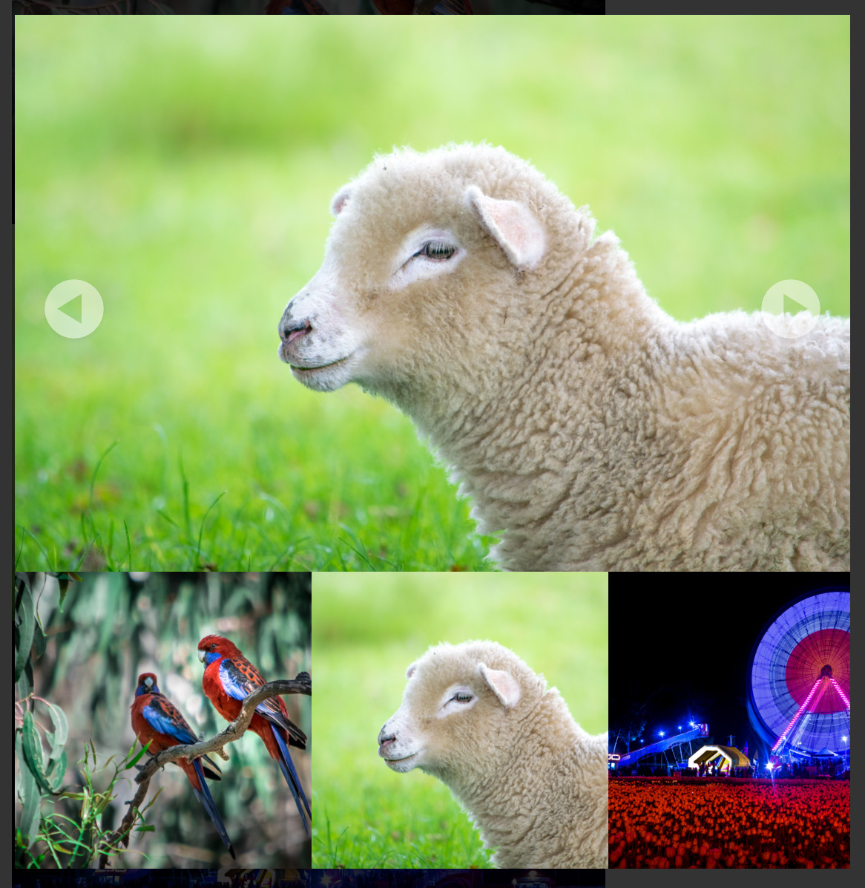

# WalnutJS

Image slider made with JavaScript. Looks for images in the chosen container. 

Now supporting background-image.

__OBS!__ Beta version



## How to implement with `` tags

1. Download the __walnut__ folder and add it to your project.

2. Add this to your HTML, I recommend at the bottom, just before `</body>` (change `src` path to fit your project):
	```javascript
	<script id="walnutScript" src="/walnut/walnut.js"></script>
	```
3. Add `class="walnut"` to the container/containers including images you want to show in the slider

4. Done! So simple!


### How to implement with `background-image: url()`

1. Download the __walnut__ folder and add it to your project.

2. Add this to your HTML, I recommend at the bottom, just before `</body>` (change `src` path to fit your project):
	```javascript
	<script id="walnutScript" src="/walnut/walnut.js"></script>
	```
3. Add `walnut-image` as an attribute to the container/containers including images you want to show in the slider
  ```<div style="background-image: url('images/example.jpg'); width: 200px; height: 200px;" walnut-image></div>```
  It's also possible to use `class="walnut-image"`

4. Add `class="walnut-image"` to the element with the background-image css.

5. Done! So simple!


## How to use
### To change image you can choose between 
   
- Clicking the buttons on the viewer
- Navigate with the keyboard buttons <- & ->
- Swipe on a touch device
- Click the picture underneath